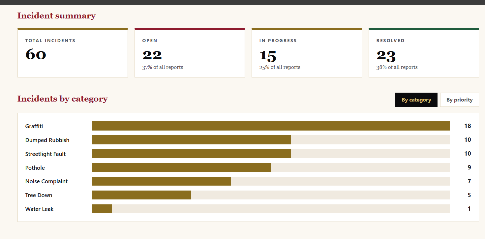
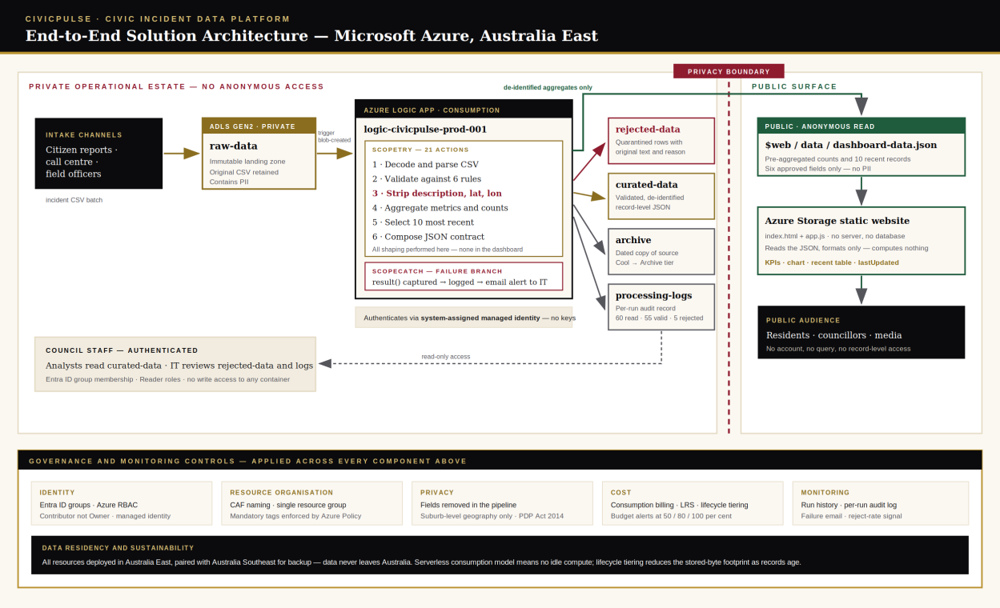
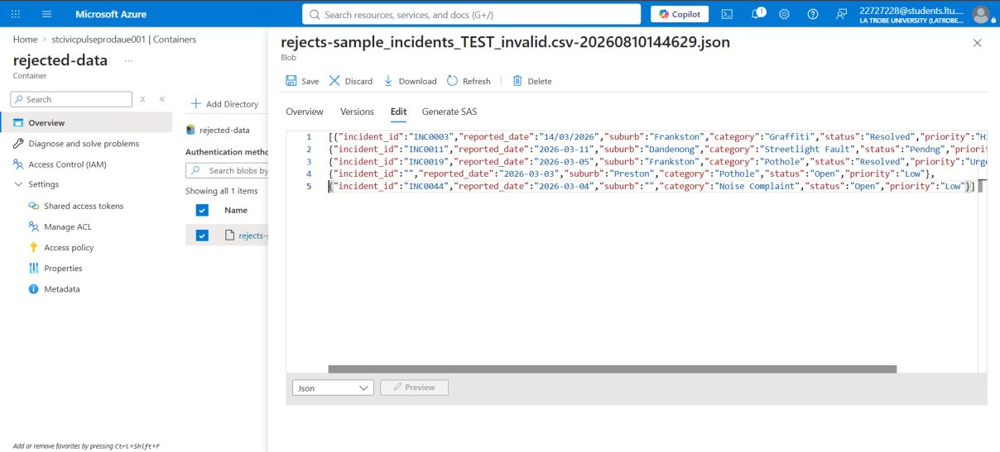
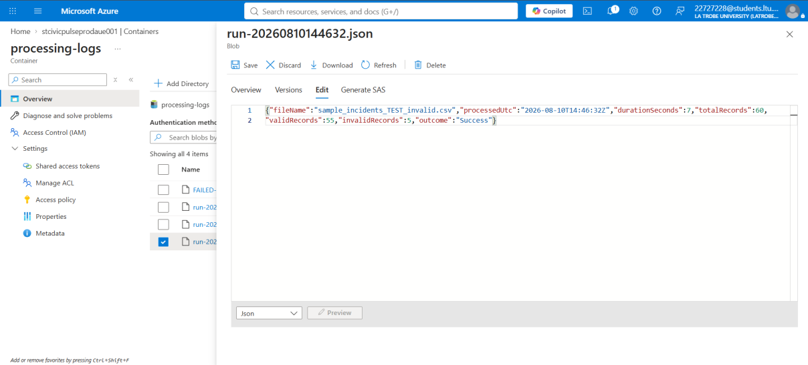
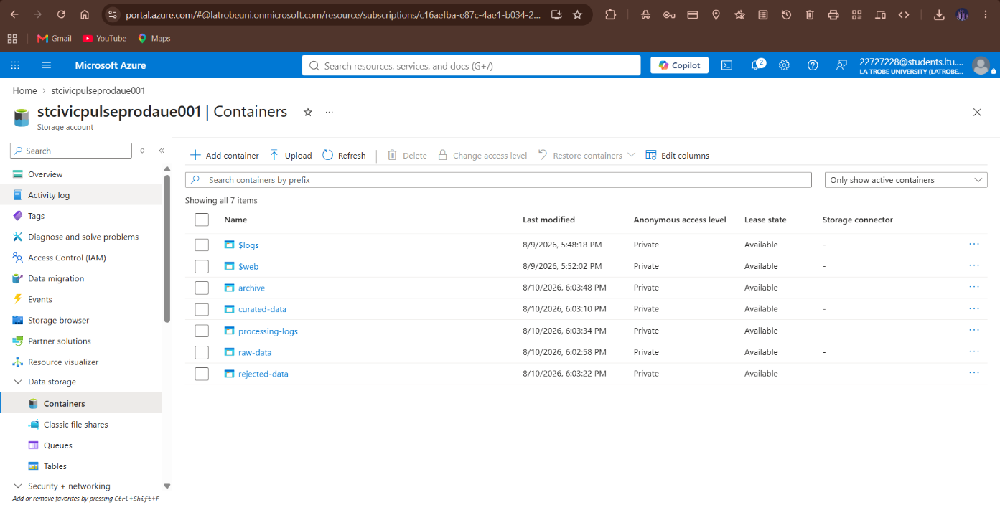
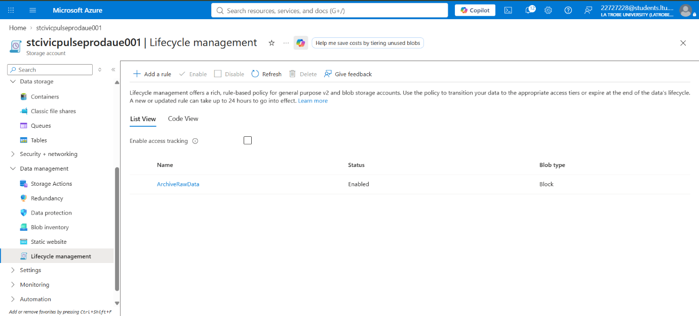
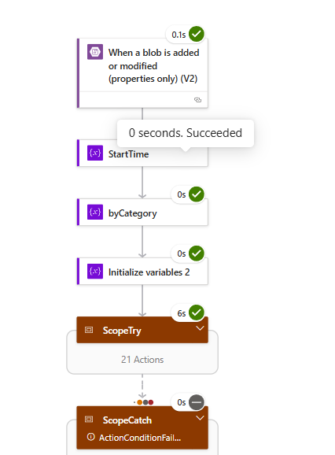

# CivicPulse — Civic Incident Data Platform

A serverless data platform that ingests council incident reports, validates and de-identifies them, and publishes an aggregate-only public dashboard. Built on Microsoft Azure for a small Victorian local council scenario.

**[View the live dashboard →](https://stcivicpulseprodaue001.z8.web.core.windows.net/)**

---

## The problem

A small council receives incident reports — potholes, graffiti, streetlight faults — through several channels, as CSV batches. Two things have to happen at once:

1. **Residents and councillors need visibility** into what is being reported and how much is being resolved.
2. **None of the personal information in those reports can ever become public.** Free-text descriptions routinely contain names and phone numbers, and a coordinate at submission precision identifies a household.

The council has a small generalist IT team, not a cloud practice. So the constraint that shaped every decision was **attention, not budget**: controls that need constant vigilance decay, controls enforced by the platform do not.

## What it does

A CSV lands in private storage. A Logic App triggers within a minute, validates every row against six rules, strips the three sensitive columns, computes aggregates, and writes a single pre-computed JSON file to the public container. A static site renders it.

The dashed line in that diagram marks the only point where data becomes publicly readable — and what crosses it is an aggregate file, never a query against a container holding personal data.

## Privacy by structure, not by configuration

This is the design decision I'd most want to talk through.

The source file has nine columns. The mapping step reads **six**. `description`, `lat` and `lon` are never referenced, so they cannot exist downstream — not in the curated zone, not in the JSON, not in the browser.

The alternative — publishing everything and hiding sensitive fields in the dashboard — would mean one careless front-end change could expose them. Excluding them in the pipeline means **no front-end change can**. The public boundary is structural rather than procedural.

## Validation and test evidence

Six rules run against every row: non-empty `incident_id`, `suburb` and `category`; a `reported_date` matching `YYYY-MM-DD`; and `status` and `priority` drawn from approved lists.

Invalid rows aren't discarded — they're quarantined in `rejected-data` with their original text and the reason they failed, so incompleteness is countable and IT can correct and resubmit rather than asking a resident to report something twice.

**Clean data proves the arithmetic works, not that bad data is stopped.** So I built a test file with five defects, one per rule: a date written `14/03/2026`, a status of `Pendng`, a priority of `Urgent`, and two empty required fields.

| Run | Rows read | Valid | Rejected |
|-----|-----------|-------|----------|
| Test file | 60 | 55 | 5 |

All five were caught and preserved verbatim; the remaining fifty-five published normally. Both runs reconcile — 60 read minus 5 rejected equals 55 published, and status counts sum to the total each time.

*Each rejected record keeps its original malformed value.*

*Per-run audit log: 60 read, 55 valid, 5 rejected.*

I calculated the expected figures from the source file **before** running it, so the output was checked against a known answer rather than just inspected.

## Storage design

Six containers, each carrying exactly one data classification — so the control that applies follows from where data sits rather than from someone's judgement.

| Container | Holds | Access |
|-----------|-------|--------|
| `raw-data` | Original file, never edited | Private |
| `curated-data` | Validated, de-identified records | Private |
| `rejected-data` | Failing rows + reason | Private |
| `archive` | Dated copy of source | Private |
| `processing-logs` | Per-run audit record | Private |
| `$web` | Dashboard + public JSON | Anonymous read |

Every record keeps its `incident_id` and each zone is partitioned by date, so any published figure traces back to the original submission — and a suspiciously low one is explained by checking the matching date in `rejected-data`.

Lifecycle rules tier ageing data automatically: Cool at thirty days (matching the tier minimum, so no early-deletion charge), Archive at ninety.

## Governance

| Control | Implementation |
|---------|----------------|
| Naming | Cloud Adoption Framework: `[type]-[workload]-[env]-[region]-[instance]` → `rg-civicpulse-prod-aue-001` |
| Tagging | Four mandatory tags enforced by Azure Policy with a **Deny** effect |
| Access | Entra ID groups, Azure RBAC at container scope |
| Identity | System-assigned managed identity — no key exists to leak |
| Least privilege | Contributor over Owner: a compromised admin account cannot grant lasting access |
| Residency | Australia East, paired with Australia Southeast — data never leaves the country |
| Cost | Budget alerts at 50 / 80 / 100 per cent of forecast |

`Owner` is a role mailbox rather than a person, so accountability survives staff turnover. No human identity has write access to any container.

## Workflow

A blob trigger on `raw-data` starts the Logic App. Validation uses two `Filter array` actions rather than a loop — one billed action regardless of row count.

Every metric is computed at runtime. Category counts derive from values actually present using a `union` expression rather than a fixed list, so a new category appears automatically. Nothing is hard-coded.

Processing sits inside a `ScopeTry`, with a `ScopeCatch` set to run on failure that captures `result('ScopeTry')`, writes a failure log and emails IT.

## Key decisions

| Decision | Reasoning |
|----------|-----------|
| Logic Apps over Functions | Logic is readable by non-developers, and run history doubles as an audit trail |
| Blob trigger over schedule | The requirement is automatic detection, not polling |
| Static hosting over App Service | No compute to patch |
| Managed identity over account keys | A credential that does not exist cannot leak |

## Known limitations

Worth stating plainly:

- Columns are read **by position**, so an inserted column upstream would silently misalign fields.
- Validation is structural, not semantic — a suburb is checked for presence, not against a gazetted list.
- No de-duplication across batches.
- LRS protects against disk failure but not loss of a region.
- Publication overwrites in place rather than atomically.

**Next, in order of value:** parse by header name, duplicate detection on `incident_id`, and an Event Grid trigger instead of polling. Beyond that — a separate storage account for `$web` so anonymous access can be disabled account-wide, Power BI over `curated-data`, and Bicep templates for reproducibility. The naming, tagging and identity model already accommodate a second department without redesign.

## Tech stack

`Azure Logic Apps` · `ADLS Gen2` · `Azure Static Website Hosting` · `Entra ID / RBAC` · `Azure Policy` · `JavaScript` · `HTML/CSS`

## Cost profile

Nothing bills at rest. The Logic App charges per action — roughly thirty per file — so a few files a day costs very little monthly. The real cost risk is unbounded log ingestion, which is why log retention is a deliberate setting rather than a default.

---

*Built for BUS5001 — Cloud Platforms and Analytics, La Trobe University. Data is synthetic.*
